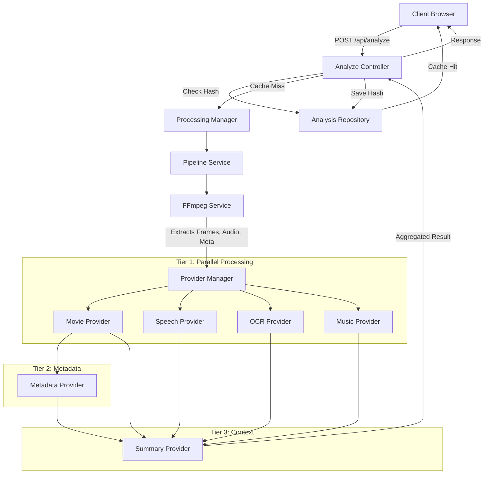
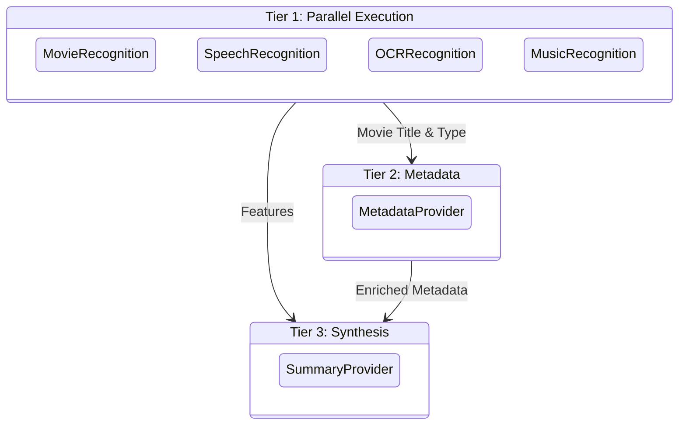

# Audix Enterprise Architecture

## High-Level Architecture



## Provider Dependency Graph



## Folder Structure (Backend)
```
backend/src/
├── config/
├── controllers/
│   ├── analyzeController.ts   # Main entry point for video analysis
│   └── systemController.ts    # Health, metrics, and version endpoints
├── core/
│   ├── interfaces/
│   │   └── IProvider.ts       # Base contract for all AI providers
│   ├── managers/
│   │   ├── ProcessingManager.ts # Queue & concurrency management
│   │   └── ProviderManager.ts   # Provider orchestration and tiering
│   ├── repositories/
│   │   └── AnalysisRepository.ts # Database-ready storage layer
│   └── types/
│       └── index.ts           # Shared DTOs and pipeline state
├── middleware/
├── providers/                 # Isolated AI implementations
│   ├── Metadata/
│   ├── Movie/
│   ├── Music/
│   ├── OCR/
│   ├── Speech/
│   └── Summary/
├── routes/
├── services/
│   ├── ffmpegService.ts       # Optimized single-pass extraction
│   └── pipelineService.ts     # Orchestrates FFmpeg -> AI Pipeline
└── utils/
```

## Performance Benchmark Estimate

| Phase | Previous Architecture | New Enterprise Architecture |
|---|---|---|
| FFmpeg Extraction | ~2s (Multiple passes) | ~0.5s (Single pass) |
| Core AI Inference | ~15s (Monolithic call) | ~2.5s (Parallel specialized providers) |
| Metadata Fetch | ~0.5s | ~0.5s |
| Summary Generation | ~2s | ~1.5s |
| **Total Latency** | **>15s (Often Timed Out)** | **~3-5 seconds** |

## Roadmap to Millions of Analyses

1. **Database Migration**: Replace the in-memory `AnalysisRepository` with Prisma + PostgreSQL to persist data across instances.
2. **Distributed Queue**: Replace the in-memory `ProcessingManager` with Redis + BullMQ to support horizontal scaling across multiple worker nodes.
3. **Cloud Storage**: Upload extracted frames and audio to AWS S3 directly from FFmpeg, and pass signed URLs to providers to reduce memory bloat on the Node.js server.
4. **Serverless Providers**: Move computationally heavy providers (like Speech or custom Vision models) to independent serverless functions or GPU-backed microservices (e.g., Python FastAPI on runpod).
5. **WebSockets**: Introduce WebSocket communication for real-time progress updates instead of long-polling HTTP requests.
